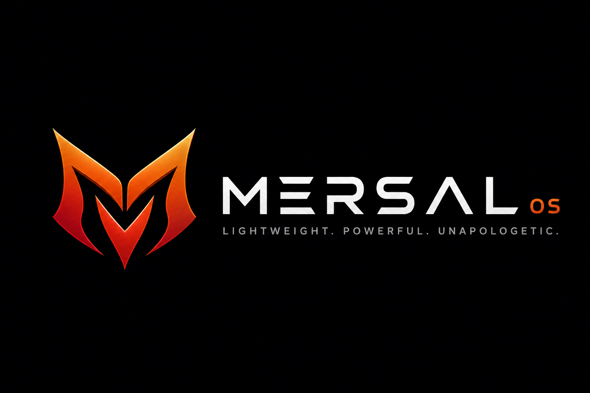
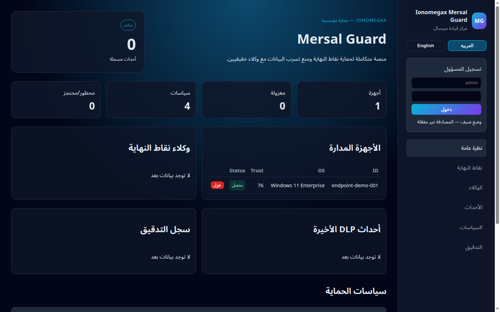
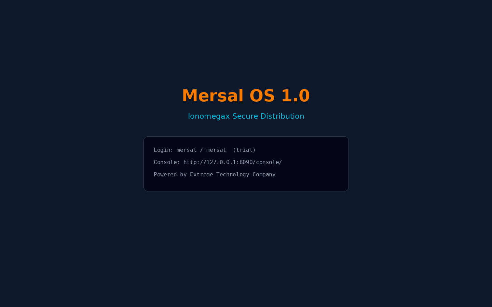
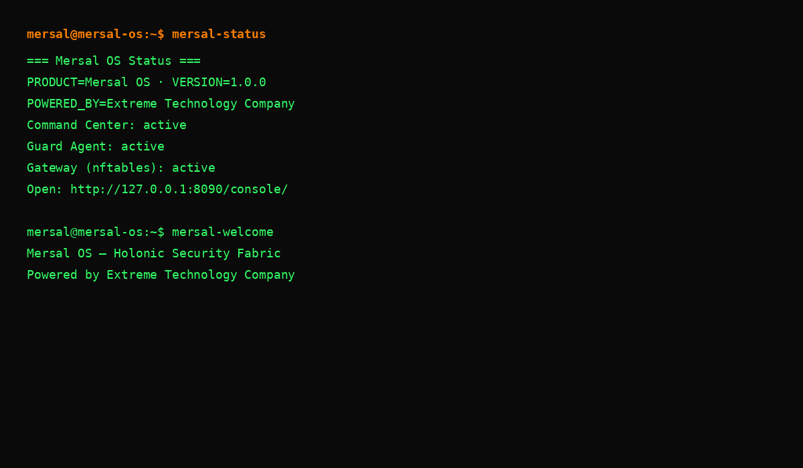

# Mersal OS — نظام التشغيل الأمني المتكامل

<p align="center">
  
</p>

<p align="center">
  <strong>Ionomegax · Mersal Guard OS</strong><br/>
  <em>Powered by Extreme Technology Company</em>
</p>

---

## ما هو Mersal OS؟

**Mersal OS** ليس مجرد واجهة ويب أو أداة مراقبة — إنه **توزيعة Linux مؤسسية متكاملة** للحماية السيبرانية، مبنية على Debian 12 (Bookworm)، وتجمع في منصة واحدة:

| المكوّن | الوظيفة |
|--------|---------|
| **Mersal Command Center** | مركز قيادة عربي/إنجليزي لإدارة الأجهزة والسياسات |
| **Mersal Guard** | حماية نقاط النهاية ومنع تسرب البيانات (DLP) |
| **Mersal Gateway** | جدار ناري وتقسيم شبكة (nftables) |
| **Mersal Update Orbit** | قناة تحديثات أمنية وسياسات |
| **Holonic Security Fabric** | نسيج سياسات موحّد بين المركز والفروع والأجهزة |

النظام مستوحى **بأفكار** منصات مثل NethServer (بوابة الفرع) وFortinet (UTM/IPS)، لكنه **منتج مستقل** بعلامة **Extreme Technology Company** ومنصة **Ionomegax**.

---

## لقطات من النظام

### مركز قيادة Mersal



لوحة تحكم مباشرة: إحصائيات، أجهزة مُدارة، أحداث DLP، سياسات حماية، سجل تدقيق.

### شاشة الإقلاع وتسجيل الدخول



### الطرفية — حالة النظام



أوامر جاهزة: `mersal-status` · `mersal-welcome` · `mersal-update`

---

## تنزيل ISO

| البند | القيمة |
|-------|--------|
| الإصدار | **1.0.0** (تجريبي — Live) |
| الملف | `mersal-os-20260528-amd64.iso` |
| الحجم | ~339 MB |
| المعمارية | amd64 (64-bit) |

**من GitHub Releases:**  
انتقل إلى [Releases](https://github.com/developer8181/ionomegax-mersal-ios/releases) وحمّل أحدث إصدار `Mersal OS 1.0`.

**التحقق من السلامة:**
```bash
sha256sum -c mersal-os-20260528-amd64.iso.sha256
```

---

## التجربة السريعة

### 1) آلة افتراضية (موصى به)

- **RAM:** 4 GB أو أكثر  
- **القرص:** 20 GB (للتجربة الحية لا يلزم تثبيت)  
- **البرنامج:** VirtualBox · VMware · QEMU  

```bash
qemu-system-x86_64 -m 4096 -smp 2 \
  -cdrom mersal-os-20260528-amd64.iso -boot d
```

### 2) بعد الإقلاع

| البند | القيمة |
|-------|--------|
| المستخدم | `mersal` |
| كلمة المرور | `mersal` |
| مركز القيادة | http://127.0.0.1:8090/console/ |
| التحديثات | http://127.0.0.1:8091/manifest.json |

---

## المعمارية: Holonic Security Fabric

```text
┌─────────────── Holon المركز ───────────────┐
│  Command Center · Update Orbit · السياسات  │
└────────────────────┬───────────────────────┘
                     │ Policy Mesh
     ┌───────────────┼───────────────┐
     ▼               ▼               ▼
  فرع Gateway    فرع Gateway    Endpoint Agent
  (nftables)     (IPS لاحقًا)    (Mersal Guard)
```

**الفكرة:** كل عقدة (مركز، فرع، جهاز) ذاتية لكنها متزامنة — ليست أدوات منفصلة بدون عقل مشترك.

اقرأ المزيد: [HOLONIC_ARCHITECTURE_AR.md](HOLONIC_ARCHITECTURE_AR.md)

---

## ما المُثبَّت مسبقًا؟

- Linux kernel 6.1 + نظام Live
- Python 3 + Mersal Guard كامل
- nftables (Mersal Gateway)
- NetworkManager · sudo · أدوات إدارة أساسية
- خدمات systemd تُطلق تلقائيًا:
  - `mersal-command-center.service`
  - `mersal-guard-agent.service`
  - `mersal-gateway.service`
  - `mersal-update-orbit.service`

---

## حدود الإصدار 1.0 (صريحة)

| متوفر الآن | قادم لاحقًا |
|-----------|-------------|
| ISO Live للتجربة | تثبيت دائم على القرص (Calamares) |
| مركز قيادة كامل | توقيع ISO رسمي |
| وكيل + بوابة أساسية | Suricata IPS مدمج مسبقًا |
| علامة Extreme | LDAP/Entra + mTLS مؤسسي |

---

## بناء ISO من المصدر

```bash
cd mersal-os
sudo apt-get install -y debootstrap squashfs-tools xorriso isolinux syslinux-utils
make iso
```

---

## الدعم والوثائق

| المستند | الوصف |
|---------|--------|
| [MASTER_PLAN_AR.md](MASTER_PLAN_AR.md) | الخطة الكاملة |
| [SECURITY_STACK_AR.md](SECURITY_STACK_AR.md) | دمج أفكار NethServer وFortinet |
| [DOWNLOAD_AR.md](DOWNLOAD_AR.md) | طرق التنزيل |
| [BUILD_ISO_AR.md](BUILD_ISO_AR.md) | بناء ISO محليًا |

---

<p align="center">
  <strong>Ionomegax</strong> · <strong>Mersal OS</strong><br/>
  Powered by <strong>Extreme Technology Company</strong>
</p>
