# التعريف الاحترافي — منصة Extreme Cyber Security

<p align="center">
  
</p>

**المنتج:** Extreme Cyber Security (ECS) · **الإصدار:** 1.0.0  
**الشركة:** Extreme Technology Company — رام الله، فلسطين  
**التصميم والتطوير:** المهندس محمود راسم بياري — مهندس أنظمة الحماية السيبرانية  
**جميع الحقوق محفوظة © 2009–2026**

> تطوّرت المنصة من سلسلة Ionomegax Mersal Guard إلى هوية **Extreme Cyber Security** مع الحفاظ على حقوق الملكية الفكرية والهندسة الأساسية.

---

## 1. الملخص التنفيذي

**Extreme Cyber Security** منصة دفاع سيبراني موحّدة للمؤسسات الكبرى (بنوك، حكومة، اتصالات، مرافق حيوية) تجمع في بنية واحدة قابلة للاستضافة الذاتية:

| المحور | القدرات |
|--------|---------|
| **مركز القيادة** | لوحة SOC ثنائية اللغة (عربي / إنجليزي) مع RTL كامل |
| **XDR** | ارتباط طبقات، عزل تلقائي، ربط SIEM ↔ SOAR |
| **SIEM** | قواعد ارتباط، تنبيهات، MITRE ATT&CK، تصدير مع مؤشرات |
| **SOAR** | مسارات تشغيل آلية واستجابة للحوادث |
| **EDR / الوكلاء** | Linux · Windows · macOS · Mersal OS — طابور تحديثات و mTLS |
| **الامتثال** | NIST-CSF · ISO · SOC2 — تقييمات مرتبطة بإعدادات حقيقية |
| **التكامل المؤسسي** | OIDC · SAML · SCIM · LDAP · نسيج SIEM |
| **الموثوقية** | PostgreSQL HA · نسخ احتياطي مشفّر · محرك موثوقية وتقارير اعتماد |

---

## 2. لمن صُمّمت المنصة؟

- **غرف عمليات الأمن (SOC)** — مراقبة، تحليل، استجابة، تدقيق hash chain  
- **فرق الامتثال والمخاطر (GRC)** — ضوابط، تقارير جاهزية، حزم أدلة  
- **فرق البنية التحتية** — نشر Docker / Postgres HA / عزل multi-tenant  
- **المؤسسات ذات المتطلبات الوطنية** — SSO، SCIM، سياسات صارمة، `MERSAL_ENTERPRISE_STRICT`

---

## 3. الهندسة والامتثال الأمني

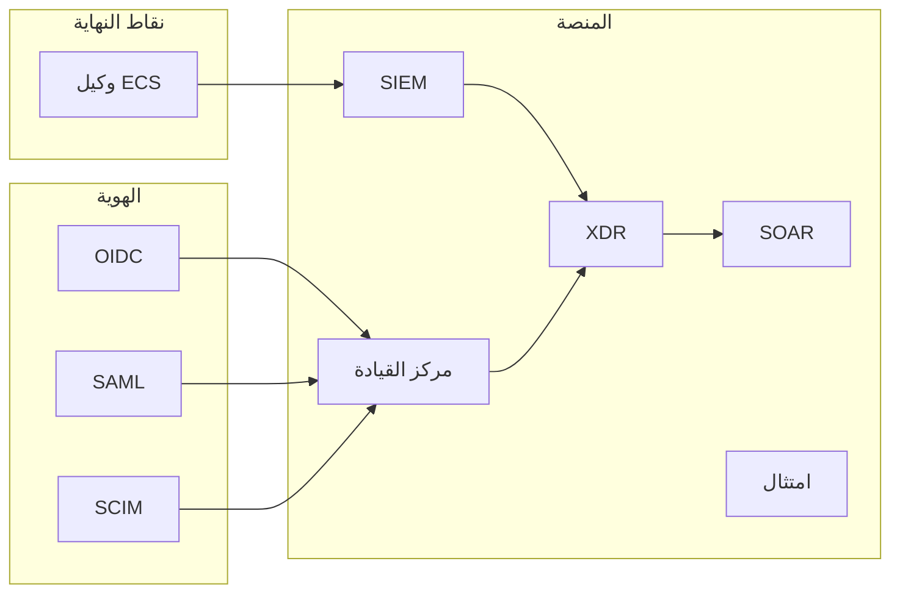

| مبدأ | التطبيق |
|------|---------|
| **الهوية** | مصادقة إلزامية على API (وضع مختبر: `MERSAL_DEV_MODE=1` فقط) |
| **الصلاحيات** | RBAC — viewer · analyst · soc_admin · super_admin |
| **العزل** | `tenant_id` على البيانات الحساسة |
| **التدقيق** | سجل سلسلة تجزئة + `/api/audit/verify` |
| **الشبكة** | TLS · rate limiting · قائمة IP · mTLS للوكلاء |

---

## 4. لقطات مركز القيادة (Command Center)

لقطات حقيقية من واجهة **Extreme Cyber Security Command Center** — الوضع الداكن، إصدار 1.0.0.

### العربية

| القسم | المعاينة |
|-------|----------|
| نظرة عامة |  |
| الجاهزية | 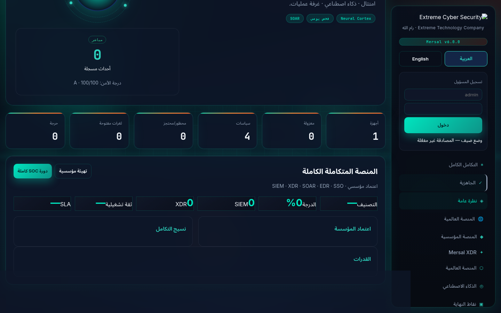 |
| المؤسسة | 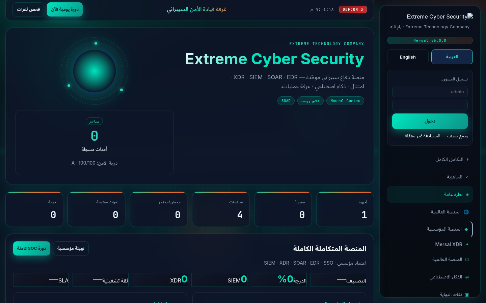 |
| XDR | 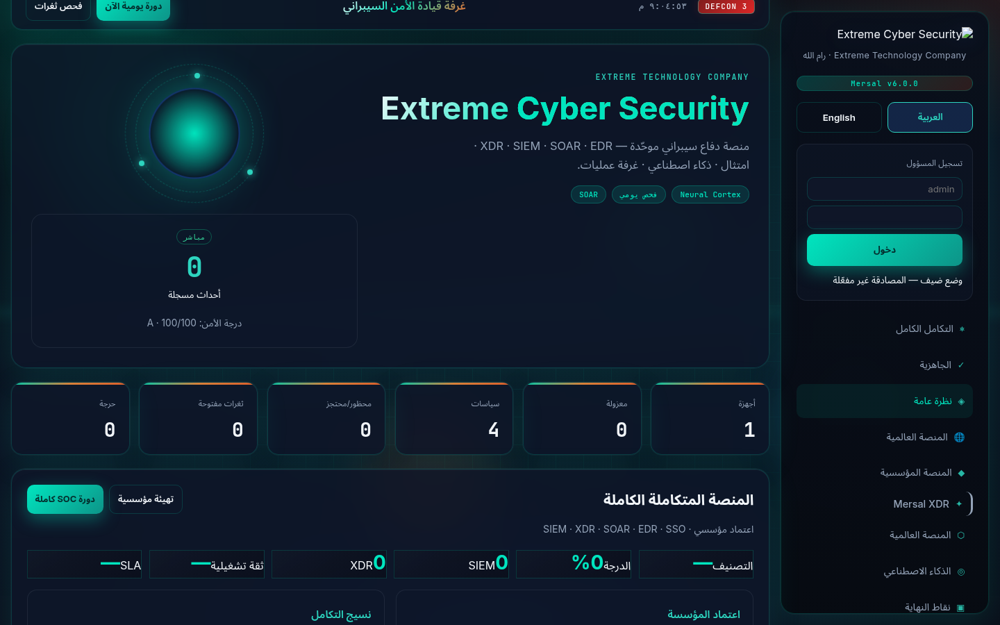 |
| نسيج الأمان |  |
| الذكاء الاصطناعي | 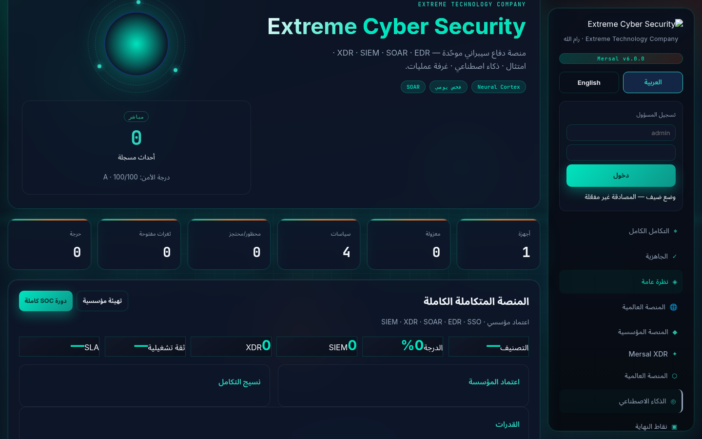 |
| نقاط النهاية | 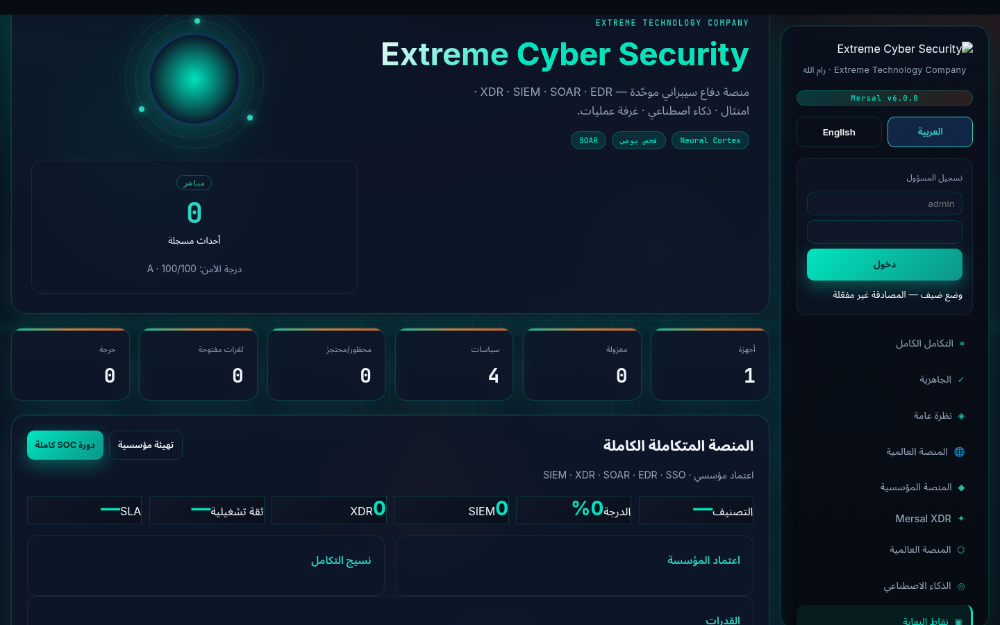 |
| الأحداث | 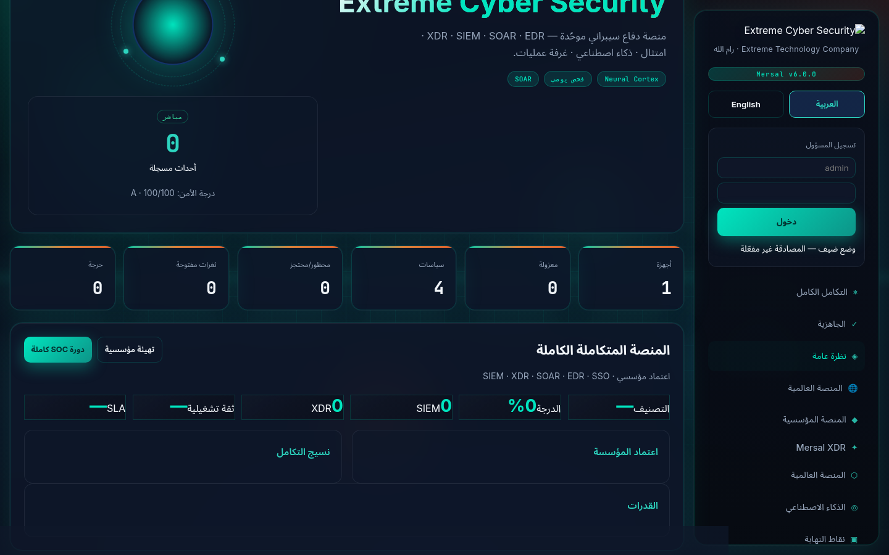 |
| السياسات |  |
| التدقيق | 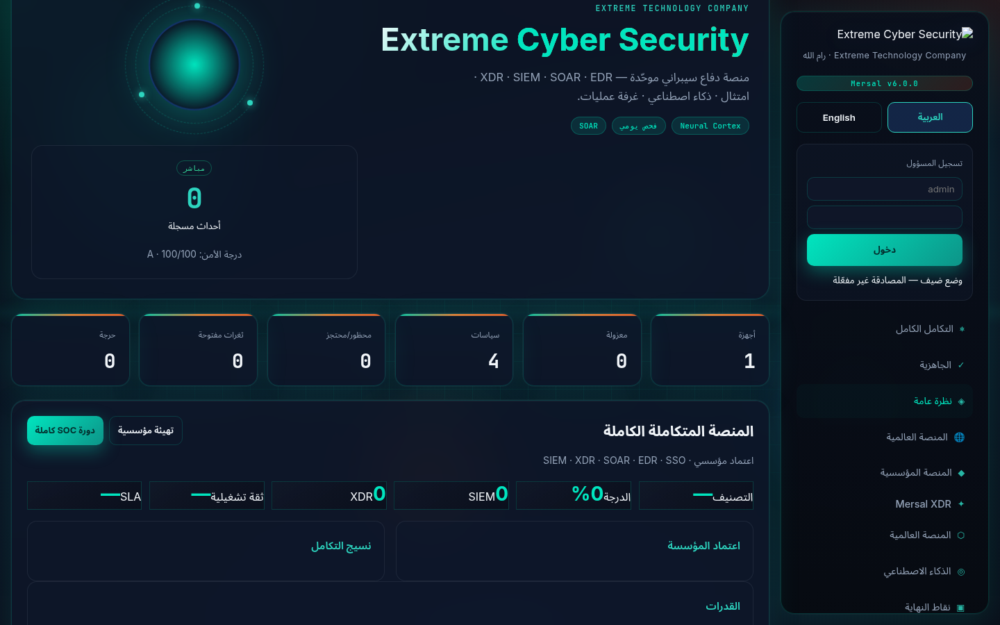 |
| حول النظام | 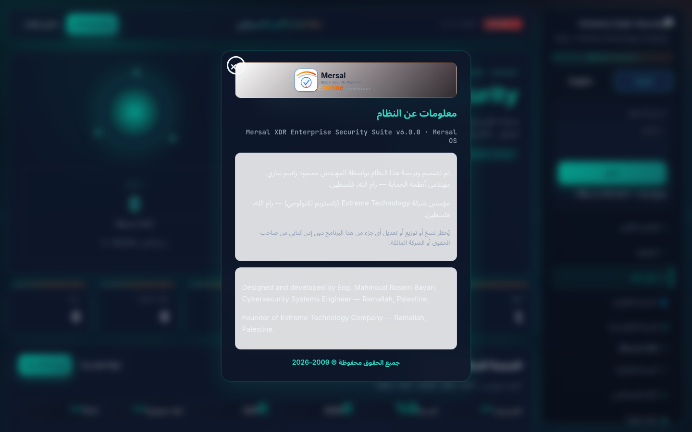 |

### English

| Section | Preview |
|---------|---------|
| Overview | 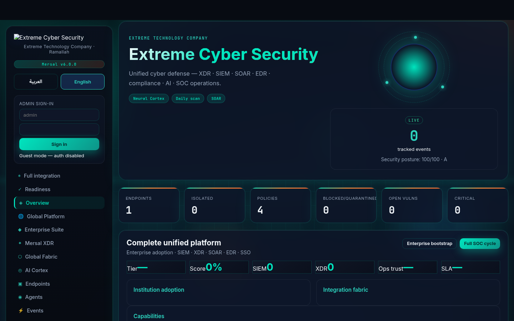 |
| Readiness |  |
| Enterprise | 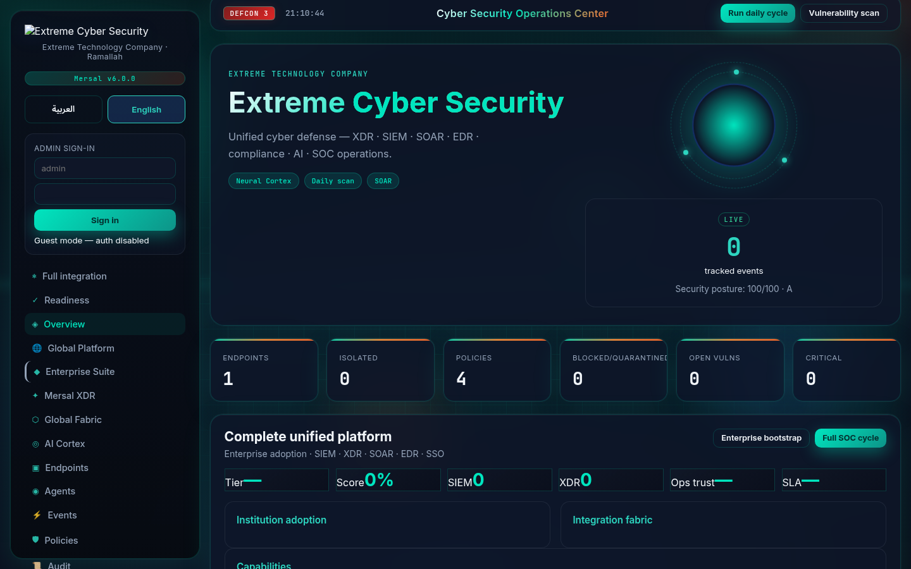 |
| XDR | 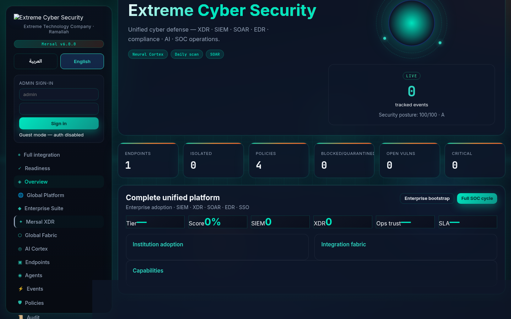 |
| Security fabric | 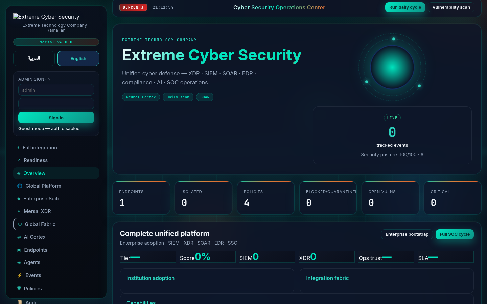 |
| Neural Cortex | 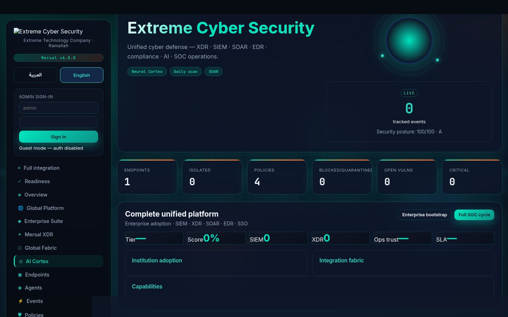 |
| Endpoints |  |
| Events | 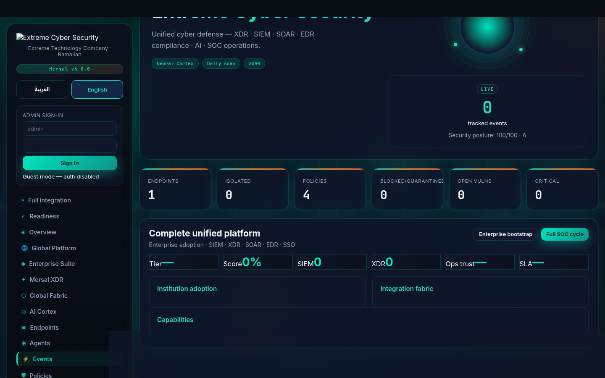 |
| About | 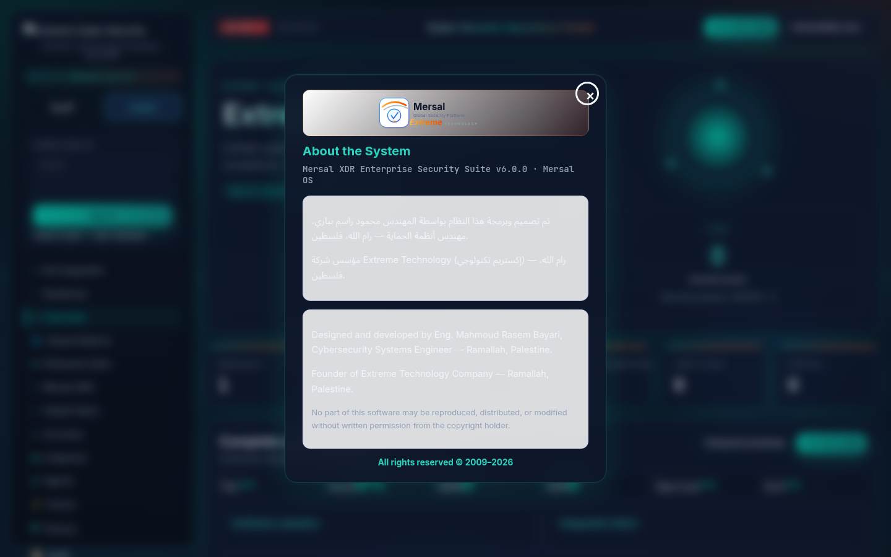 |

**إعادة توليد اللقطات:**

```bash
cd xtreme-ip-guard
python3 scripts/capture_screenshots_standalone.py
```

---

## 5. التثبيت السريع

```bash
git clone https://github.com/developer8181/ionomegax-mersal-ios.git
cd ionomegax-mersal-ios/xtreme-ip-guard
make enterprise-install
source mersal-guard.env
python3 -m xig
# المتصفح: http://127.0.0.1:8090/console/
```

**تثبيت مؤسسي كامل:**

```bash
./scripts/mersal-complete-install.sh mersal-guard.env
```

---

## 6. وثائق تقنية إضافية

| الوثيقة | المحتوى |
|---------|---------|
| [PLATFORM_MASTER_AR.md](PLATFORM_MASTER_AR.md) | الدليل الرئيسي للمنصة |
| [MERSAL_v8_7_COMPLETE_PLATFORM_AR.md](MERSAL_v8_7_COMPLETE_PLATFORM_AR.md) | المنصة الموحّدة v8.7 |
| [MERSAL_v8_9_ADVANCED_RELIABILITY_AR.md](MERSAL_v8_9_ADVANCED_RELIABILITY_AR.md) | محرك الموثوقية |
| [PROFESSIONAL_PROFILE_EN.md](PROFESSIONAL_PROFILE_EN.md) | English professional profile |

---

## 7. التواصل والحقوق

| | |
|--|--|
| **الموقع** | https://github.com/developer8181/ionomegax-mersal-ios |
| **الدعم** | security@extreme-technology.ps |
| **الترخيص** | ملكية خاصة — راجع [COPYRIGHT.md](../COPYRIGHT.md) |

يُحظر نسخ أو توزيع أو تعديل أي جزء من هذا البرنامج دون إذن كتابي من صاحب الحقوق.

---

*Extreme Technology Company · Ramallah, Palestine · Extreme Cyber Security Platform 1.0.0*
