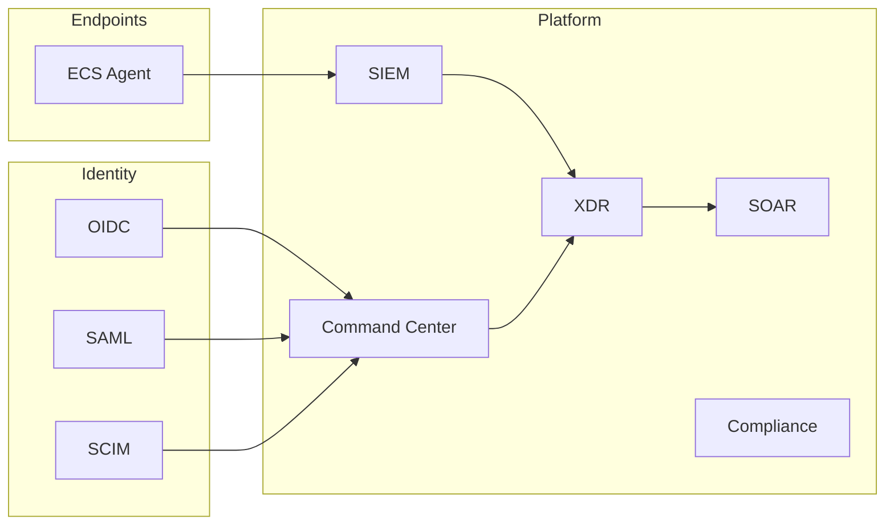

# Professional Profile — Extreme Cyber Security Platform

<p align="center">
  
</p>

**Product:** Extreme Cyber Security (ECS) · **Version:** 1.0.0  
**Company:** Extreme Technology Company — Ramallah, Palestine  
**Designed & developed by:** Eng. Mahmoud Rasem Bayari — Cybersecurity Systems Engineer  
**All rights reserved © 2009–2026**

> The platform evolved from the **Ionomegax Mersal Guard** lineage into the **Extreme Cyber Security** product identity while preserving copyright and core engineering.

---

## 1. Executive summary

**Extreme Cyber Security** is a self-hosted, unified enterprise cyber defense platform for large institutions (banking, government, telecom, critical infrastructure). It consolidates:

| Domain | Capabilities |
|--------|----------------|
| **Command Center** | Bilingual SOC console (Arabic / English), full RTL |
| **XDR** | Cross-layer correlation, auto-isolation, SIEM ↔ SOAR bridge |
| **SIEM** | Correlation rules, alerts, MITRE ATT&CK, cursor-based export |
| **SOAR** | Playbooks and automated incident response |
| **EDR / agents** | Linux · Windows · macOS · Mersal OS — update queue, mTLS |
| **Compliance** | NIST-CSF · ISO · SOC2 — assessments tied to real settings |
| **Enterprise integration** | OIDC · SAML · SCIM · LDAP · SIEM fabric |
| **Reliability** | PostgreSQL HA · encrypted backup/restore · reliability engine & adoption scorecard |

---

## 2. Target audience

- **Security operations (SOC)** — monitoring, analysis, response, hash-chain audit  
- **GRC & risk** — controls, readiness reports, evidence packs  
- **Infrastructure teams** — Docker, Postgres HA, multi-tenant isolation  
- **National-scale deployments** — SSO, SCIM lifecycle, strict enterprise mode

---

## 3. Security architecture



| Principle | Implementation |
|-----------|----------------|
| **Identity** | Mandatory API authentication (lab only: `MERSAL_DEV_MODE=1`) |
| **Authorization** | RBAC — viewer · analyst · soc_admin · super_admin |
| **Isolation** | `tenant_id` on sensitive data |
| **Audit** | Hash-chain log + `/api/audit/verify` |
| **Network** | TLS · rate limiting · IP allowlist · agent mTLS |

---

## 4. Command Center screenshots

Live captures from **Extreme Cyber Security Command Center** — dark theme, v1.0.0.

### Arabic

| Section | Preview |
|---------|---------|
| Overview |  |
| Readiness |  |
| Enterprise |  |
| XDR |  |
| Security fabric |  |
| Neural Cortex |  |
| Endpoints |  |
| Events |  |
| Policies |  |
| Audit |  |
| About |  |

### English

| Section | Preview |
|---------|---------|
| Overview |  |
| Readiness |  |
| Enterprise |  |
| XDR |  |
| Security fabric |  |
| Neural Cortex |  |
| Endpoints |  |
| Events |  |
| About |  |

**Regenerate:**

```bash
cd xtreme-ip-guard
python3 scripts/capture_screenshots_standalone.py
```

---

## 5. Quick start

```bash
git clone https://github.com/developer8181/ionomegax-mersal-ios.git
cd ionomegax-mersal-ios/xtreme-ip-guard
make enterprise-install
source mersal-guard.env
python3 -m xig
# Browser: http://127.0.0.1:8090/console/
```

**Full enterprise install:**

```bash
./scripts/mersal-complete-install.sh mersal-guard.env
```

---

## 6. Related documentation

| Document | Content |
|----------|---------|
| [PLATFORM_MASTER_AR.md](PLATFORM_MASTER_AR.md) | Platform master guide (Arabic) |
| [MERSAL_v8_7_COMPLETE_PLATFORM_AR.md](MERSAL_v8_7_COMPLETE_PLATFORM_AR.md) | Unified platform v8.7 |
| [MERSAL_v8_9_ADVANCED_RELIABILITY_AR.md](MERSAL_v8_9_ADVANCED_RELIABILITY_AR.md) | Reliability engine |
| [PROFESSIONAL_PROFILE_AR.md](PROFESSIONAL_PROFILE_AR.md) | التعريف الاحترافي بالعربية |

---

## 7. Contact & legal

| | |
|--|--|
| **Repository** | https://github.com/developer8181/ionomegax-mersal-ios |
| **Support** | security@extreme-technology.ps |
| **Copyright** | Proprietary — see [COPYRIGHT.md](../COPYRIGHT.md) |

No part of this software may be reproduced, distributed, or modified without written permission from the copyright holder.

---

*Extreme Technology Company · Ramallah, Palestine · Extreme Cyber Security Platform 1.0.0*
